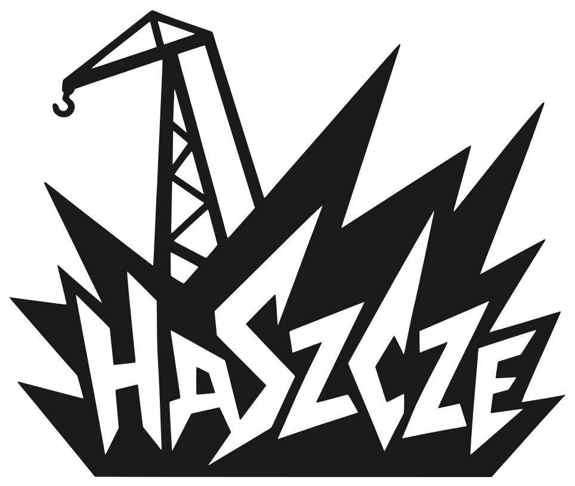

# Emblemat do sygnatury e-mail

Wersje logo przycięte pod generator sygnatur e-mail
([HackerspaceSzczecin/generator-stopki-haszcze](https://github.com/HackerspaceSzczecin/generator-stopki-haszcze),
działa pod <https://haszcze.eu/projects/email-signature-generator/>).

To **sam emblemat** (dźwig + haszcze), bez napisu "Hackerspace Szczecin" -
w sygnaturze ten napis jest zwykłym tekstem obok, więc w grafice byłby
zdublowany.

## Pliki

- `haszcze-emblem.svg` - emblemat czarny `#1A1A1A`, przezroczyste tło
- `haszcze-emblem-yellow.svg` - emblemat żółty `#F5C400`, przezroczyste tło
- `haszcze-emblem.png` - raster czarnego emblematu, 150x127 px,
  przezroczyste tło; **ten plik trafia do każdego wysłanego maila**
  (szczegóły niżej)

## Gdzie te pliki żyją i kto ich używa

| Miejsce | Rola |
| ------- | ---- |
| ten folder | źródło prawdy |
| `https://haszcze.eu/brand/haszcze-emblem.png` | **produkcja** - każda wygenerowana sygnatura linkuje ten adres |
| repo strony, `public/brand/` | serwuje ten adres; generowane z tego repo |
| repo generatora, `assets/` | kopia robocza (podgląd na stronie generatora, favicon) |

Adres `/brand/` jest wypalony w sygnaturach już wklejonych do klientów
pocztowych ludzi - **nie wolno go zmieniać ani usuwać pliku**. Sygnatura ma
fallback (żółty kafel z tekstem "HS"), więc zniknięcie pliku nie psuje maili
katastrofalnie, ale logo znika u wszystkich naraz.

Dlaczego PNG, a nie SVG albo data URI: klienty pocztowe nie renderują SVG,
a Gmail wycina z podpisów adresy `data:`. Musi być raster pod publicznym HTTPS.

## Jak te pliki powstały (i jak je odtworzyć)

SVG to `haszcze-logo.svg` z katalogu głównego tego repo z dwiema zmianami:

1. `viewBox="0 0 1254 1254"` podmieniony na `viewBox="163 83 964 816"` -
   to bbox tuszu samego emblematu (zmierzony na oryginalnym PNG 1254x1254:
   x 179-1111, y 99-883, plus 16 px marginesu). Napis "Hackerspace Szczecin"
   (wiersze 923-1122) zostaje poza kadrem.
2. Dla wersji żółtej dodatkowo `fill="#1A1A1A"` -> `fill="#F5C400"`.

Geometria ścieżek jest identyczna jak w plikach głównych - to tylko kadr
i kolor.

PNG to render `haszcze-emblem.svg` w 150x127 px (3x docelowego rozmiaru
50x42 px w sygnaturze, żeby był ostry na HiDPI), przezroczyste tło.
Np. headless Chrome:

```bash
# render.html: strona bez marginesów z 
chrome --headless --disable-gpu --hide-scrollbars \
  --default-background-color=00000000 \
  --screenshot=haszcze-emblem.png --window-size=150,127 render.html
```

albo `rsvg-convert -w 150 -h 127 haszcze-emblem.svg -o haszcze-emblem.png`.

## Odtwarzanie po awarii

Jeśli `https://haszcze.eu/brand/haszcze-emblem.png` przestanie odpowiadać:
w repo strony ([HackerspaceSzczecin/haszcze-website](https://github.com/HackerspaceSzczecin/haszcze-website))
podbij wskaźnik submodułu `vendor/haszcze-logo` na aktualny commit tego repo,
a potem zbuduj i zdeployuj stronę zgodnie z jej instrukcją deployu -
`scripts/prebuild.mjs` sam wyłoży `haszcze-emblem.png` pod `/brand/`.
Nie kopiuj pliku ręcznie do `public/brand/`: ten katalog jest generowany
przy każdym buildzie, więc ręczna wrzutka zostanie nadpisana. Nic więcej
nie trzeba - sygnatury wskazują stały adres.
